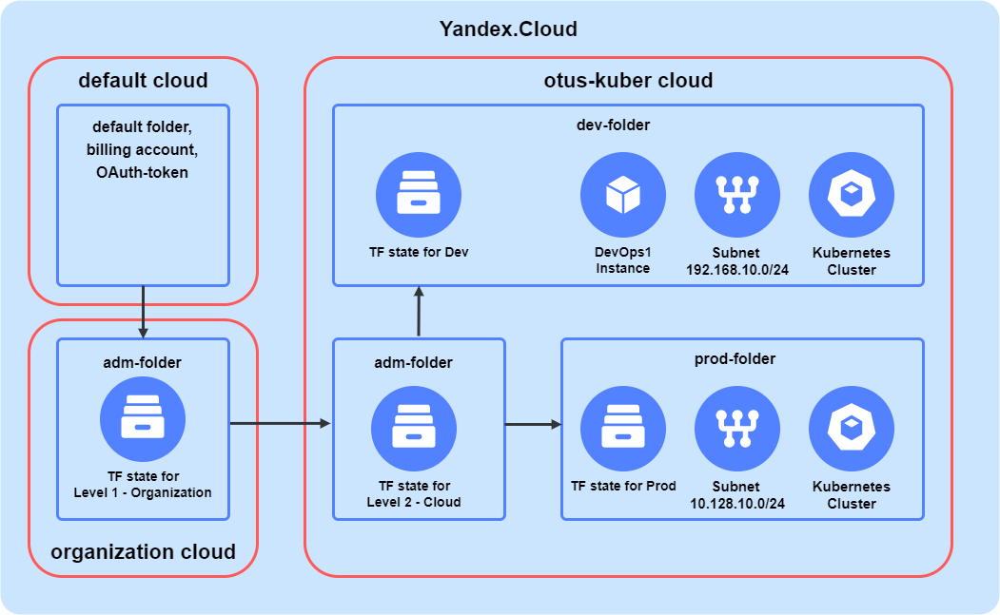

# Infrastructure Part of Repository

## About the Project

This repository was developed to provide examples of how to deploy Kubernetes infrastructure platform (within OTUS learning course) to Yandex Cloud.

Organization structure and IAM have been taken _with some simplifications_ from Yandex Cloud reference design.
Pls see (https://github.com/yandex-cloud/yc-solution-library-for-security/blob/master/auth_and_access/org_iac_iam/README.md)

Organization structure consists of 3 clouds in Yandex Cloud organization account:
- default cloud (to bootstrap next organization entities)
- organization (to manage project clouds)
- otus-kuber (for Development and Production environments)

Default cloud has at least one initial Default folder.

Organization cloud has only one adm-folder with object storage to store Organization level Terraform state.

Otus-kuber cloud has 3 folders:
- adm-folder (with object storage to store Cloud level Terraform state)
- dev-folder (for Development environment)
- prod-folder (for Production environment)

Each of 4 Terraform state could be managed by 4 different admins:
- Organization level admin (to create new clouds for new projects)
- Cloud level admin (to create folders for different environments within the cloud)
- Development folder admin
- Production folder admin




## Getting Started

Repository structure:
```
infrastructure
├── 1-organization - Organization level Terraform project (to create new clouds within different organizations)
│   ├── activate-yc-profile.ps1 - script (Windows) for initial configuration of Yandex Cloud CLI and OS environmental variables
│   ├── activate-yc-profile.sh - script (Linux) for initial configuration of Yandex Cloud CLI and OS environmental variables
│   ├── ... - files related to Terraform project
├── 2-cloud - Cloud level Terraform project (to create new folders within specific cloud)
│   ├── activate-yc-profile.ps1 - script (Windows) for initial configuration of Yandex Cloud CLI and OS environmental variables
│   ├── activate-yc-profile.sh - script (Linux) for initial configuration of Yandex Cloud CLI and OS environmental variables
│   ├── ... - files related to Terraform project
├── 3-development - Development environment level Terraform project (to deploy Development infrastructure within specific cloud)
│   ├── activate-yc-profile.ps1 - script (Windows) for initial configuration of Yandex Cloud CLI and OS environmental variables
│   ├── activate-yc-profile.sh - script (Linux) for initial configuration of Yandex Cloud CLI and OS environmental variables
│   ├── ... - files related to Terraform project
├── 4-production - Production environment level Terraform project (to deploy Production infrastructure within specific cloud)
│   ├── activate-yc-profile.ps1 - script (Windows) for initial configuration of Yandex Cloud CLI and OS environmental variables
│   ├── activate-yc-profile.sh - script (Linux) for initial configuration of Yandex Cloud CLI and OS environmental variables
│   ├── activate-alb.ps1 - script (Windows) to create service account key to access Yandex Cloud Container Registry
│   ├── activate-alb.sh - script (Linux) to install YC ALB ingress controller Helm chart
│   ├── ... - files related to Terraform project
├── images - some images
├── modules - common Terraform modules to use in Terraform projects
│   ├── bucket - for YC object sorage
│   ├── cloud - for YC cloud resourse 
│   ├── folder - for YC folder resourse 
│   ├── instance - for YC compute instance 
│   ├── k8s-cluster - for YC Managed Kubernetes cluster
│   ├── k8s-node - for YC Managed Kubernetes cluster node group
│   ├── sa - for YC service account
│   ├── subnet - for YC VPC subnet
├── templates - cloud-init userdata templates to use in instances deploymnet
```

## Installation Instructions

These instructions demonstrate how to deploy Kubernetes infrastructure platform into Yandex.Cloud.

**To be performed from your Windows or Linux personal computer**

### Pre-requisites (Powershell CLI for Windows or BASH or Other Shell for Linux Terminal)

1. Yandex Cloud command line interface - [yc cli](https://cloud.yandex.com/en/docs/cli/quickstart#install)
2. Terraform command line interface - [terraform cli](https://cloud.yandex.com/en/docs/tutorials/infrastructure-management/terraform-quickstart)
3. Configure Terraform provider to work with Yandex.Cloud (https://cloud.yandex.ru/docs/tutorials/infrastructure-management/terraform-quickstart#configure-provider).
4. Create new account or prepare **cloud-owner user** credentials for existing Yandex.Cloud account.
5. To create new clouds in Yandex.Cloud with Terraform first cloud and folder should be created manually in [Yandex.Cloud web console](https://console.cloud.yandex.ru/). Initial cloud and folder are created automatically when creating new Yandex Cloud account.
6. **yc cli** profile with name **default** should be created to manage Yandex.Cloud account.
Pls run **yc init** command and follow interactive instructions to create **default** profile. OAuth token for Yandex.Cloud account will be asked.
7. Pls get **Organization ID** and **Billing account ID** from [Yandex.Cloud web console](https://console.cloud.yandex.ru/) to use them in Terraform in _infrastructure/1-organization/main.tf_
8. **git cli** - is provided in all modern Linux distributions. For Windows you may install it from [Download git for Windows] (https://git-scm.com/download/win)
9. Provide to GitLab project admin your personal SSH-public key from key pair stored on your computer user profile to add it to GitLab repository settings.

The rest tools will be installed automatically (by cloud-init scipts) on DevOps instance.


###  Create Administrative and Project Clouds within Yandex.Cloud Account Organization (Terraform)

Pls run following commands (Windows cmd commands will be used as examples, for Linux use relevant shell commands and provided scripts):
1. **git clone git@gitlab.praktikum-services.ru:std-010-065/momo-store.git**
2. **cd momo-store\infrastructure\1-organization**
3. **.\activate-yc-profile.ps1** # to create (activate) **momo-organization** yc profile and set environment variables with **OAuth-token**, **cloud-id** and default folder **folder-id**.
4. **copy versions.tf versions.s3** # and delete _backend "s3" {}_ section in **versions.tf**
5. **terraform init**
6. Open _infrastructure/1-organization/main.tf_ file and replace **cloud_organization_id** and **cloud_billing_account_id** with values from your YC account.
7. terraform apply

**organization** and **otus-kuber** clouds will be created. **adm-folder** and Object storage for Terraform state file will be created in both clouds. Pls open _infrastructure/1-organization/terraform.tfstate_, find 
```
"module": "module.organization-cloud",
"mode": "managed",
"type": "yandex_storage_bucket",
"name": "s3-tfstate",
...
        "access_key":"<access key>"
...
        "secret_key":"<secret key"
```
and
```
"module": "module.otus-kuber",
"mode": "managed",
"type": "yandex_storage_bucket",
"name": "s3-tfstate",
...
        "access_key":"<access key"
...
        "secret_key":"<secret key"
```
and take values of **"access_key"** and **"secret_key"** and save them in file in secured location.
Create **secrets.ps1** with following content replacing access and secret keys with values from **module.organization-cloud** section of **terraform.tfstate** file:
```
# Set static keys for access to TS state S3 storage 
$Env:AWS_ACCESS_KEY_ID     = "<access_key from module.organization-cloud>"
$Env:AWS_SECRET_ACCESS_KEY = "<secret_key from module.organization-cloud>"
[Environment]::SetEnvironmentVariable('AWS_ACCESS_KEY_ID', $Env:AWS_ACCESS_KEY_ID, 'User')
[Environment]::SetEnvironmentVariable('AWS_SECRET_ACCESS_KEY', $Env:AWS_SECRET_ACCESS_KEY, 'User')  
```

You may also create another **secrets.ps1** with access and secret keys with values from **module.otus-kuber** section of **terraform.tfstate** file to provide it for the person engaged in creation of folders in momo-store cloud (_/infrastructure/2-cloud - Cloud level Terraform project_).

8. **.\secrets.ps1** # to set environment variables with **access key** and **secret key**, to access to **organization** cloud S3 backend for Terraform state file in adm-folder.
9. **copy versions.s3 versions.tf**
10. **terraform init -migrate-state** # to store Terraform state file in relevant Yandex.Cloud S3 backend.


###  Create Development and Production Folders within momo-store Cloud (Terraform)

Pls run following commands:
1. **cd momo-store\infrastructure\2-cloud**
2. **.\activate-yc-profile.ps1** # to create (activate) **momo-cloud** yc profile and set environment variables with **OAuth-token** and **cloud-id**.
3.  **copy versions.tf versions.s3** # and delete _backend "s3" {}_ section in **versions.tf**
4. **terraform init**
5. **terraform apply**

**dev-folder** and **prod-folder** folders will be created in **momo-store** cloud. Object storage for Terraform state file will be created in both folders. Pls open_ _infrastructure/2-cloud/terraform.tfstate__, find access and secret keys for **dev-folder** and **prod-folder** s3-tfstate buckets and save them in secured location. You also have to prepare **secrets.ps1** scripts with keys for **dev-folder** and **prod-folder**.

6. **.\secrets.ps1** # to set environment variables with **access key** and **secret key**, provided to access to **momo-store** cloud S3 backend for Terraform state file in **adm-folder**.
7. **copy versions.s3 versions.tf**
8. **terraform init -migrate-state** # to store Terraform state file in relevant Yandex.Cloud S3 backend.

###  Deploy Development Environment (Terraform)

Pls run following commands. All terraform resourses can be created and modified **only** within **dev-folder** due to restricted permissions of YC service account used for Terraform provider:
1. **cd infrastructure\3-development**
2. **.\activate-yc-profile.ps1** # to create (activate) **otus-kuber-dev** yc profile and set environment variables with **cloud-id** and **folder-id**.
3. **.\secrets.ps1** # to set environment variables with **access key** and **secret key**, provided to access to **otus-kuber** cloud S3 backend for Terraform state file in **dev-folder**.

copy **id_rsa.pub** file with ssh public key to momo-store\infrastructure\3-development\secrets\devops1. It will be copied to development DevOps engineer instance. In case of several DevOps engineers, pls create devops2, devops3 and so on folders with relevant key files.
Also **count** value in module **"devops-instance"** in **main.tf** should be changed to number of created instances.

4. **terraform init**
5. **terraform apply**

**DevOps** instances with all tools to deploy infrastructure in Kubernetes will be created, as well as all networks, subnets, service accounts and security groups. You can get **DevOps** instance IP address from Yandex Cloud web-console or from Terraform output **external_ip_address**.

###  Deploy Production Environment (Terraform)

Pls run following commands. All terraform resourses can be created and modified **only** within **prod-folder** due to restricted permissions of YC service account used for Terraform provider:
1. **cd infrastructure\4-production**
2. **.\activate-yc-profile.ps1** # to create (activate) **otus-kuber-prod** yc profile and set environment variables with **cloud-id** and **folder-id**.
3. **.\secrets.ps1** # to set environment variables with **access key** and **secret key**, provided to access to **otus-kuber** cloud S3 backend for Terraform state file in **dev-folder**.

copy **id_rsa.pub** file with ssh public key to momo-store\infrastructure\4-production\secrets\devops1. It will be copied to Kubernetes cluster worker nodes to access them via SSH. In case of several DevOps engineers only one SSH key could be added for user **devops1**.

4. **terraform init**
5. **terraform apply**

Kubernetes cluster with group of worker nodes will be created, as well as all necessary networks, subnets, service accounts and security groups.

### Connect to Managed Kubernetes Cluster in Yandex Cloud

To get credentials for Kubernetes Cluster in Development environment pls run following command:

** yc managed-kubernetes cluster   get-credentials k8s-otus-kuber-dev-cluster-1 --external **
